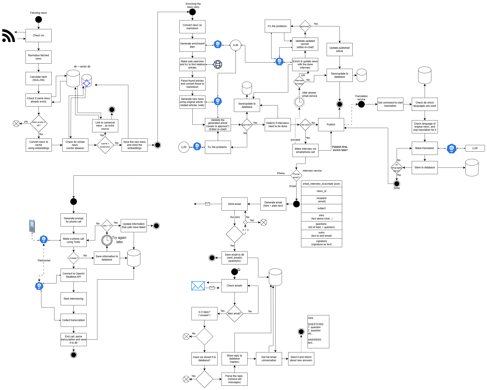
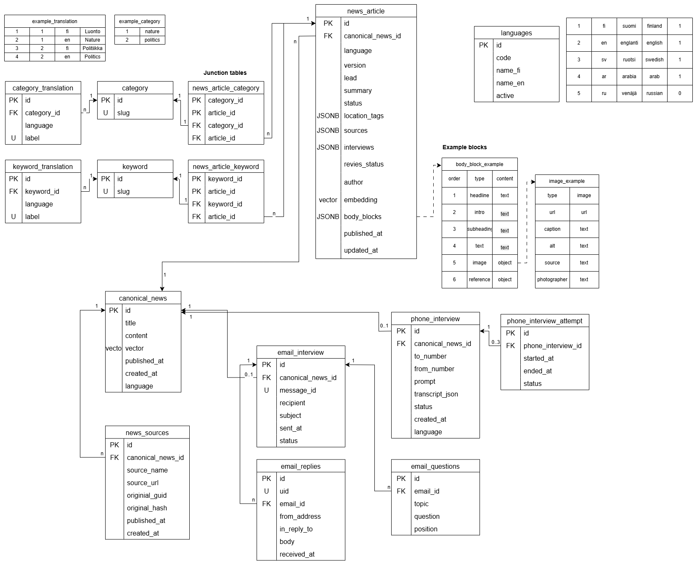

# AI Prototypes and Experiments

This repository contains prototypes and experimental implementations related to various ideas and subproblems.  
Each subdirectory contains a self-contained project with its own code, dependencies, and `README.md`.

These projects are intended for testing, learning, and rapid development purposes — not for production use.

## Structure

- Each folder is an isolated prototype or concept.
- Dependencies are defined per project (e.g. `requirements.txt`).
- Some projects may use Docker and `.env` files for testing environments.

## Notes

- Prototypes may be incomplete or exploratory by nature.
- Keep sensitive data out of version control (see `.gitignore`).
- See individual `README.md` files inside each project folder for details.

## Projects

- **newsroom_frontend/**  
  Next.js 15, Apollo Client, GraphQL-based multilingual news frontend with SSR and SEO support.  
  See diagrams and details in `newsroom_frontend/README.md`.

- **newsroom_backend/**  
  GraphQL backend for news content, supports localized content and is optimized for SSR/SEO scenarios.

- **contact_email/**  
  Prototype for sending email messages (contact forms, notifications).

- **contact_speech/**  
  Speech-based contact and interview functionality (e.g. for phone interviews, audio collection or call routing).

- **news_similarity/**  
  Prototype for storing news articles as vector embeddings and finding semantically similar ones using SentenceTransformers and pgvector.

- **rss_fetching/**  
  Experiments with fetching news content from RSS feeds, generating original article drafts, and enriching them with related news using semantic similarity.

- **gradio_tool_for_news_validation/**  
  Extension of "rss_fetching". Shows process for generating and validating news, including web enrichment and logging agent reasoning.

- **Editor in Chief/**  
  Tests whether the editor-in-chief accepts or rejects real published news. Focus on prompt engineering for editorial decision-making and rationale logging.

## Architecture and Database

### News Generation & Processing Workflow

- Illustrates the main process for fetching, enriching, validating, and publishing news.
- Shows email and phone interview integration.

### Database Schema

- Main tables and relationships for storing news, sources, interviews, emails, and categories.
- Supports multilingual news, rich body blocks, and both phone/email interviews.