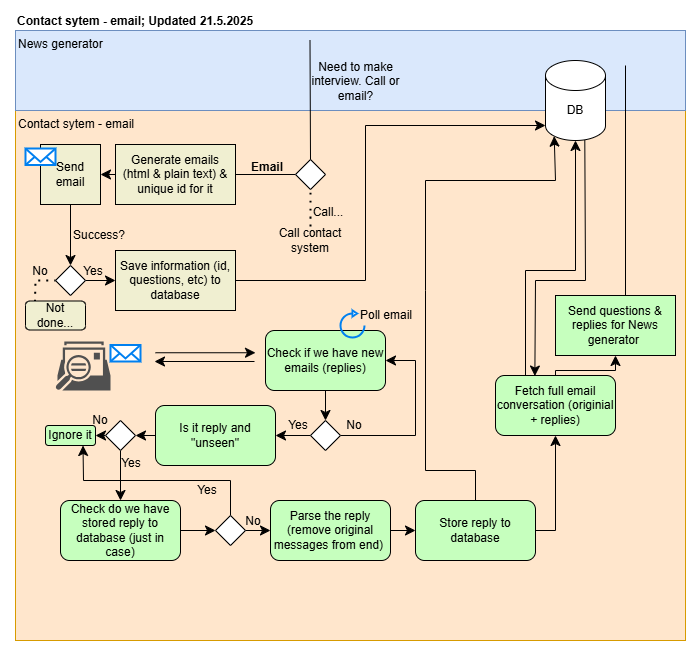
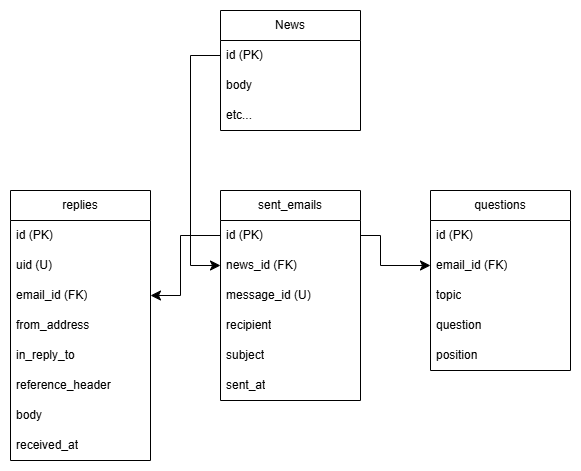

# EMAIL CONFIGURATION

This project includes **sending and reading emails** using SMTP and IMAP. To enable email functionality, follow these steps:

---

## ARCHITECTURE OVERVIEW



- Sends email inquiries related to a specific news item
- Recipients can respond freely via email
- All messages and responses are stored in a structured database
- Answers are extracted and forwarded to an LLM for automated analysis or summary generation

---

## DATABASE STRUCTURE

The system uses a normalized SQLite database consisting of the following tables:



> - `sent_emails.news_id` links the email to the related news article  
> - `questions` are stored separately for structured referencing  
> - `replies` may contain multiple responses per email  

---

## SETUP INSTRUCTIONS

To install the required dependencies and run the project in isolation, create a Python virtual environment:
### 1. Create and activate virtual environment
python -m venv .venv
.venv\Scripts\activate

### 2. Install required packages
pip install -r requirements.txt

## 3. Required Environment Variables

Create a `.env` file in the project root with the following variables:

```env
# OpenAI
OPENAI_API_KEY=your_openai_api_key

# Gmail
EMAIL_HOST_GMAIL=smtp.gmail.com
IMAP_HOST_GMAIL=imap.gmail.com
EMAIL_ADDRESS_GMAIL=CHANGE_ME@gmail.com
EMAIL_PASSWORD_GMAIL=CHANGE_ME_PASSWORD

# Outlook
EMAIL_HOST_OUTLOOK=smtp.office365.com
IMAP_HOST_OUTLOOK=imap.office365.com
EMAIL_ADDRESS_OUTLOOK=CHANGE_ME@outlook.com
EMAIL_PASSWORD_OUTLOOK=CHANGE_ME_PASSWORD

# Yleiset portit
EMAIL_PORT=587
IMAP_PORT=993
```

> **Note:** You can switch between Gmail and Outlook accounts by selecting the appropriate configuration in the code.

## 4. Gmail App Password Setup (Required for Gmail accounts) 

If you're using Gmail, a regular password will **not work** with SMTP/IMAP due to security policies. You **must use an App Password**.

### Steps:

1. Enable **2-Step Verification**
   [https://myaccount.google.com/security](https://myaccount.google.com/security)

2. Go to **App Passwords**
   [https://myaccount.google.com/apppasswords](https://myaccount.google.com/apppasswords)

3. Create a new app password:

   * Enter a custom name (e.g., `LangChainAgent`)
   * Google will generate a 16-character password

4. Copy the generated password and set it as `EMAIL_PASSWORD_GMAIL` in your `.env` file
   **Do not include spaces.**


MUUTA:
Available folders: ['Henkilökohtainen', 'INBOX', 'Laskut', 'Luonnokset', 'Lähetetty', 'Roska', 'Roskakori', 'Sent', 'Työ', 'Välitystiedot', '[Gmail]', '[Gmail]/Kaikki viestit', '[Gmail]/Luonnokset', '[Gmail]/Lähetetyt viestit', '[Gmail]/Roskakori', '[Gmail]/Roskaposti', '[Gmail]/Tähdellä merkityt', '[Gmail]/Tärkeää']