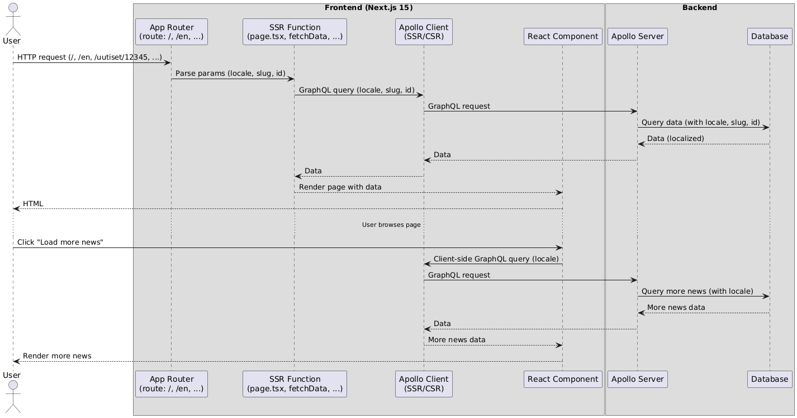
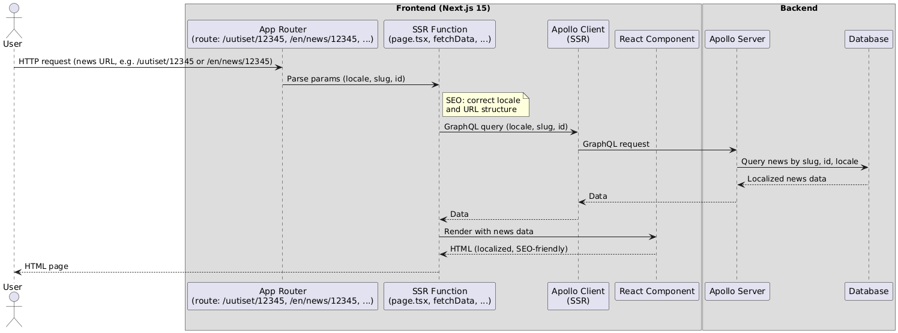

# Frontend

- **Framework:** Next.js 15 (App Router)
- **Internationalization:** i18n enabled (next-intl)
- **Data fetching:** GraphQL (Apollo Client)

## Installation

### Prerequisites
- Node.js 18+ 
- npm or yarn

### Setup

```bash
# Clone the repository
git clone
cd newsroom_frontend

# Install dependencies
npm install

# Run development server (with Turbopack)
npm run dev
```

Open [http://localhost:3000](http://localhost:3000) to view the application.

### Available Scripts

```bash
npm run dev          # Start development server with Turbopack
npm run build        # Build for production
npm run start        # Start production server
npm run lint         # Run ESLint
```

## Structure

- **Homepage:**  
  `src/app/[locale]/page.tsx`  
  - SSR (Server Side Rendering)  
  - Language via `[locale]` param

- **Single news pages:**  
  `src/app/[locale]/[slug]/[id]/page.tsx`  
  - SSR  
  - Parameters: `[locale]`, `[slug]`, `[id]`  
  - Own news (custom slugs and ids) always SSR

- **Load more news:**  
  - On the homepage, loading more news happens client-side (Apollo Client, GraphQL)

## How localization and slugs work

- `[locale]`: language (e.g. fi, en)
- `[slug]`: news page path
- `[id]`: individual news id

## Architecture Diagrams

### 1. General Data Flow (SSR and CSR)



- Shows how data is fetched both server-side (SSR) and client-side (CSR).
- Highlights the flow from the user's request to database queries and rendering.

### 2. News Page SEO (Localized SSR and SEO-friendly URLs)



- Demonstrates navigation directly to a localized news page (e.g. `/uutiset/12345` or `/en/news/12345`).
- Shows how SSR renders localized, SEO-friendly HTML.
- Locale and URL structure are optimized for search engines.

## Example URL structures

- Homepage in Finnish (default): `/`
- Single news in Finnish: `/uutiset/12345`
- Homepage in English: `/en`
- Single news in English: `/en/news/12345`

> Note: The Finnish language (default) does **not** have a `/fi` prefix in the URL.  
> Only non-default languages have a locale prefix in the URL (`/en`, `/sv`, etc.).

## Summary

- SSR provides SEO and fresh content.
- All data is fetched from a GraphQL API.
- i18n is handled via routing and GraphQL query variables.
