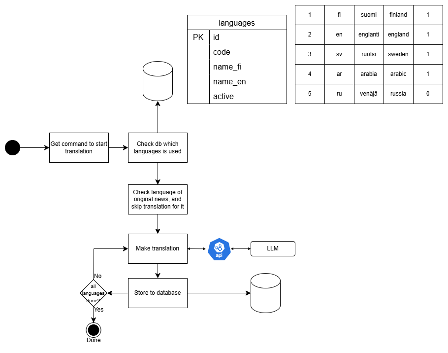

# News Translation Service

This application translates news articles into multiple languages using OpenAI, validates and structures the data with Pydantic models, and stores everything in a SQLite database.

## Usage

1. Set your OpenAI API key as the environment variable `OPENAI_API_KEY`.
2. Run the program:

## Structure

- **main.py** – Main logic: translation and saving
- **database.py** – Database operations (SQLite)
- **schemas.py** – Pydantic models for articles and content blocks
- **mockdata/** – Example data as JSON

## Translation Pipeline Overview

Below is a simplified architecture of the translation process:

**Description:**
- The application reads active languages from the `languages` table in the database.
- For each original news article, it loops through all active target languages (skipping the article’s own language).
- Each translation is generated using the OpenAI LLM API.
- Translated articles are stored back in the database, one row per language version.
- The process repeats until all required languages are done.

## Notes

- Each article is translated to each target language in a single OpenAI API call (JSON structure: lead, summary, body_blocks).
- All data is stored in structured format.
- After translation, always convert body_blocks to Pydantic objects:
